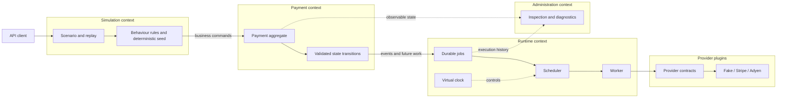
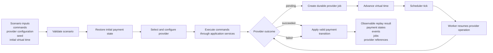
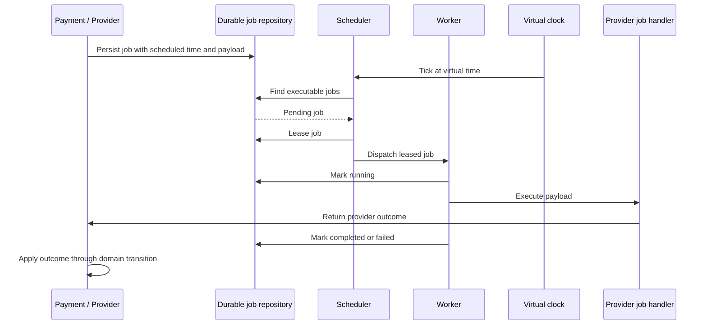
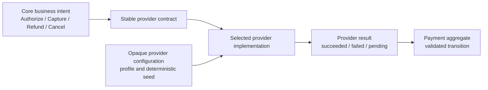

# Architecture Diagrams

This page contains the canonical diagrams for Payment Sandbox. They describe
responsibilities and flows at the architecture level; they are not class or
implementation diagrams.

## Contexts and dependency direction

The system is a modular monolith with four bounded contexts. Simulation plans
behaviour, Payment owns business invariants, Runtime executes durable work and
Administration observes the system.

The arrows represent collaboration through contracts. Simulation and Runtime
do not mutate Payment state directly, and providers do not own payment
transitions.

## Deterministic replay

Replay receives every input that may affect business behaviour. The provider
configuration is opaque to the replay core and is interpreted by the selected
provider implementation.

A pending outcome does not transition the payment by itself; the eventual
provider result must pass through the payment state machine.

## Durable asynchronous execution

Asynchronous work follows the Runtime lifecycle. The scheduler decides when a
job is eligible, while the worker executes the registered handler. Neither
component interprets provider-specific payloads.

The production Runtime uses durable persistence. Replay uses the same job
lifecycle with an execution-scoped repository so one replay cannot affect
another replay.

## Provider plugin boundary

The core expresses business intent and validates business results. Providers
translate that intent and keep their profiles, references, timing and failure
decisions local to their own implementation.

Provider implementations are replaceable. The replay core must not branch on
provider identity or duplicate provider-specific rules.
